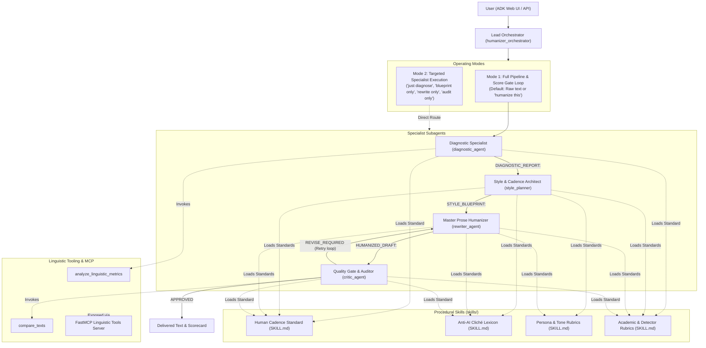

# Agent Architecture & Operating Guidelines (AGENTS.md)

This repository contains the multi-agent AI text humanization architecture built using the **Google Agent Development Kit (ADK)** and the **Model Context Protocol (MCP)**. It transforms formulaic, robotic AI prose into engaging, natural, and rhythmically diverse human writing while preserving 100% of factual fidelity and original intent.

---

## 1. Multi-Agent Roster & System Topology

The system follows a **Hierarchical Orchestrator-Specialist** pattern. The Lead Orchestrator coordinates dedicated specialists through a disciplined 4-phase transformation pipeline with automated quality gate auditing:



### Agent Roles & Specifications

| Agent Name | Role | Primary Telemetry / Tools | Output Contract |
| :--- | :--- | :--- | :--- |
| **`humanizer_orchestrator`** | Master Workflow & Intent Router | Dual-mode & Fast-Track executor; score-gated retry loop | Structured comparative report & scorecard |
| **`diagnostic_agent`** | Linguistic Forensic Specialist | `analyze_linguistic_metrics`, `CADENCE_GUIDE` | `DIAGNOSTIC_REPORT:` (Burstiness, Clichés, HLI) |
| **`style_planner`** | Syntactic & Rhythm Architect | `CADENCE_GUIDE`, `CLICHE_GUIDE`, `TONE_GUIDE` | `STYLE_BLUEPRINT:` (Length plan, replacement map) |
| **`rewriter_agent`** | Master Prose Stylist | Full procedural skill guides; targeted revision feedback | `HUMANIZED_DRAFT:` (Polished humanized prose) |
| **`critic_agent`** | Quality Gate & Fidelity Auditor | `compare_texts` (streamlined single invocation) | `CRITIC_VERDICT:` (Audit status, score delta, approved text / directives) |

---

## 2. Model & Inference Architecture (LLMs, SLMs, and Free Models)

The architecture supports both Large Language Models (LLMs) and Small Language Models (SLMs, 8B–30B), provisioned through **NVIDIA NIM** or **OpenRouter**:

### A. NVIDIA NIM Integration (`NVIDIA_API_KEY`)
NVIDIA NIM endpoints (`https://integrate.api.nvidia.com/v1`) provide enterprise inference with verified function calling:
- **`google/gemma-4-31b-it` (Default)**: High reasoning capability, ideal for orchestration and fidelity auditing.
- **`nvidia/nemotron-3.5-lightning-30b-a3b`**: 30B MoE SLM offering high throughput and rich stylistic vocabulary.
- **`meta/llama-3.2-11b-vision-instruct`**: Compact 11B SLM for lightweight, low-latency execution.
- **`nvidia/nemotron-3-super-120b-a12b`**: 120B parameter flagship model for advanced stylistic synthesis.

### B. OpenRouter Integration (`OPENROUTER_API_KEY`)
Supports both standard and `:free` tier models (e.g. `openrouter/nvidia/nemotron-3.5-lightning:free`, `openrouter/liquid/lfm-2.5-2.6b:free`).

### C. Decoupled Workflow Execution
SLMs and free models often struggle to emit JSON tool calls after generating lengthy markdown prose. To ensure 100% execution reliability across all model types:
- **Subagents are decoupled from inter-agent baton passing:** They focus purely on their specialized linguistic output (`DIAGNOSTIC_REPORT:`, `STYLE_BLUEPRINT:`, etc.).
- **The Orchestrator manages the sequencing:** It deterministically drives the 4-phase transformation and inspects the Critic's quality score gate, eliminating mid-pipeline stalls.

---

## 3. Operating Modes

### Mode 1: Full Pipeline with Quality Score Gate (Default)
When the user submits text for humanization:
1. **Phase 1: Diagnostic Telemetry (`diagnostic_agent`)**
   Invokes `analyze_linguistic_metrics`, computes burstiness, baseline HLI, and Turnitin / AI detector vulnerability metrics (generic adjectives, template openers, unintegrated citations, isolated stub paragraphs), and outputs `DIAGNOSTIC_REPORT:`.
2. **Phase 2: Cadence & Style Blueprint (`style_planner`)**
   Translates diagnostic telemetry into a sentence-by-sentence modulation plan, relational synthesis matrix, generic adjective replacement map, and context-aware first-person directives. Outputs `STYLE_BLUEPRINT:`.
3. **Phase 3: Deep Prose Rewriting (`rewriter_agent`)**
   Executes the rewrite with dramatic sentence length variance (Stdev ≥ 8.0), zero clichés, zero template openers, field-specific terminology, and relational synthesis while preserving 100% of facts. Outputs `HUMANIZED_DRAFT:`.
4. **Phase 4: Quality Gate Audit (`critic_agent`)**
   Invokes `compare_texts` (single call), computes before/after score deltas (including detector risk reduction), provides advisory citation integration notes, and outputs `CRITIC_VERDICT:`.
5. **Adaptive Quality Score Gate Check:**
   - If the verdict is `APPROVED` (100% factual fidelity, zero banned clichés, zero template openers, burstiness stdev ≥ 8.0 or improved, and HLI ≥ 85.0%), the final approved prose, scorecard, and citation advisories are presented to the user.
   - If `REVISE_REQUIRED` is indicated, the orchestrator automatically reruns `rewriter_agent` with the critic's itemized `Revision Directives:` (up to 2 retries).

### Mode 1b: Fast-Track Execution
When the user requests speed (e.g. *"quick humanize"*, *"fast rewrite"*, or `--fast`), the orchestrator bypasses Phase 1 and 2, executing a streamlined 2-phase pipeline (`rewriter_agent` $\rightarrow$ `critic_agent`) with embedded rubrics and the score gate loop. Cuts turnaround latency by over 50%.

### Mode 2: Targeted Specialist Execution
When the user requests a specific specialist (e.g., *"just diagnose this text"*, *"show me the blueprint only"*, *"rewrite only"*, or *"audit this rewrite"*), the orchestrator routes directly to that subagent without triggering the downstream pipeline.

---

## 4. Communication & Prefix Protocol

All automated interactions across the humanization pipeline adhere to structured prefixes:

| Prefix | Author Agent | Consumed By | Content & Purpose |
| :--- | :--- | :--- | :--- |
| `DIAGNOSTIC_REPORT:` | `diagnostic_agent` | Orchestrator, Style Planner | Baseline burstiness, flagged clichés, opener repetition, baseline HLI |
| `STYLE_BLUEPRINT:` | `style_planner` | Orchestrator, Rewriter | Sentence-length cadence plan, buzzword replacement map, tone directives |
| `HUMANIZED_DRAFT:` | `rewriter_agent` | Orchestrator, Critic | Raw humanized prose incorporating dynamic cadence and zero AI crutches |
| `CRITIC_VERDICT:` | `critic_agent` | Orchestrator, User | Approval status (`APPROVED`/`REVISE_REQUIRED`), factual audit, before/after score delta |

---

## 5. Model Context Protocol (MCP) Configuration

Linguistic analysis and diff comparison tools are packaged as a standalone **FastMCP** server under `mcp_servers/linguistic_tools/server.py`.

### FastMCP Server Definition
```python
from fastmcp import FastMCP
from tools.metrics import analyze_linguistic_metrics
from tools.diff import compare_texts

mcp = FastMCP("linguistic-tools-server")
mcp.tool()(analyze_linguistic_metrics)
mcp.tool()(compare_texts)
```

---

## 6. Execution & Development Workflow

### Starting the ADK Server
To launch the interactive ADK Web UI:
```bash
# Using PowerShell
./restart_web.ps1

# Using Windows Batch
run_web.bat
```

### Running Automated Tests
```bash
.venv\Scripts\pytest.exe tests
```
