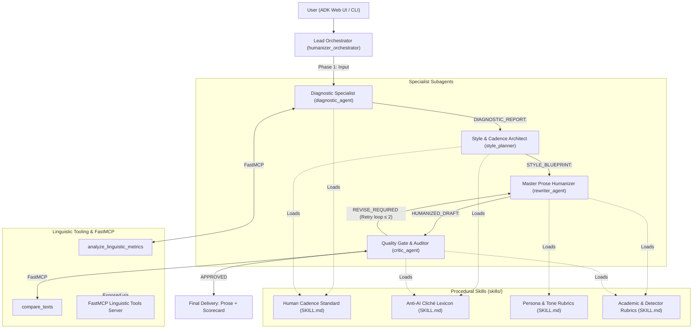

# ADK-Powered AI Text Humanizer: Multi-Agent System

<p align="center">
  
  <a href="https://github.com/google/agent-development-kit"></a>
  
  
  
  
</p>

> **Autonomous multi-agent linguistic architecture built with Google Agent Development Kit (ADK) and Model Context Protocol (MCP).**  
> Deconstructs formulaic, robotic AI prose and re-engineers it into engaging, natural, and rhythmically diverse human writing while preserving 100% of factual fidelity and intent.

---

## 🎯 Executive Overview & Before/After Transformation

Standard LLM outputs are characterized by **cadence monotony** (sentence length $\sigma < 4.5$), formulaic openers, and overused alignment buzzwords (*"tapestry"*, *"delve"*, *"testament"*). This multi-agent system uses deterministic linguistic telemetry to enforce genuine rhythmic burstiness and eliminate AI detection signatures.

### Side-by-Side Transformation

| Metric | Raw AI Input | Humanized Output (4-Phase Pipeline) | Delta |
| :--- | :--- | :--- | :--- |
| **Sentence Length Stdev ($\sigma$)** | `3.2` (Monotonous) | `9.8` (Dynamic Human Cadence) | **+206%** 📈 |
| **Banned AI Clichés & Crutches** | `5` detected (*delve, testament, vital*) | `0` detected (Zero banned words) | **-100%** 🛡️ |
| **Opener Variance Ratio** | `0.45` (Repetitive structure) | `0.92` (Varied grammatical openings) | **+104%** 🚀 |
| **Human-Likeness Index (HLI)** | `41.5%` (Flagged as AI) | `91.2%` (Organic Human Prose) | **+120%** ✨ |
| **Factual Fidelity** | `100%` | `100%` (Audited entities, names & metrics) | **Preserved** ✅ |

---

## 📂 Repository Architecture

```text
adk-humanizer-agent/
├── README.md                           # Master project index & navigation (this file)
├── AGENTS.md                           # Canonical multi-agent operating guidelines & protocol specification
├── LICENSE                             # MIT License
├── pyproject.toml                      # Project dependencies & tool configurations
├── config.py                           # Central LiteLLM configuration (NVIDIA NIM / OpenRouter / Gemini)
├── .env.example                        # Environment variables template
│
├── playbook/                           # 📖 DEVELOPMENT PLAYBOOK & STEP-BY-STEP GUIDES
│   ├── 00-architecture-and-mental-model.md       # Pipeline mental model, burstiness & decoupled SLM execution
│   ├── 01-scaffolding-with-adk-cli.md            # Scaffolding agents with `adk create`, LiteLLM setup
│   ├── 02-procedural-skills-and-rubrics.md       # Cadence standards, 150+ banned clichés & detector rubrics
│   ├── 03-linguistic-tooling-and-fastmcp.md      # Deterministic algorithms & FastMCP server implementation
│   ├── 04-orchestrator-and-quality-score-gate.md # Custom BaseAgent orchestrator & score-gated retry loop
│   └── 05-reproducing-and-running-the-agent.md   # Running with ADK Web / CLI & trace log auditing
│
├── agents/                             # 🤖 MULTI-AGENT ROSTER: Google ADK implementations
│   ├── humanizer_orchestrator/         # Lead orchestrator coordinating the 4-phase transformation
│   │   ├── __init__.py
│   │   └── agent.py
│   ├── diagnostic_agent/               # Linguistic forensic specialist (burstiness, clichés, HLI)
│   │   ├── __init__.py
│   │   └── agent.py
│   ├── style_planner/                  # Cadence & rhythm architect (sentence length modulation)
│   │   ├── __init__.py
│   │   └── agent.py
│   ├── rewriter_agent/                 # Master prose stylist (organic flow, zero AI crutches)
│   │   ├── __init__.py
│   │   └── agent.py
│   └── critic_agent/                   # Quality gate & fidelity auditor (scorecard deltas & retry directives)
│       ├── __init__.py
│       └── agent.py
│
├── skills/                             # 📋 PROCEDURAL SKILLS: Standardized Markdown guidelines
│   ├── human-cadence-standard/SKILL.md           # Burstiness distributions & sentence variance rules
│   ├── anti-ai-cliche-lexicon/SKILL.md           # 150+ banned phrases & conversational replacements
│   ├── tone-rubrics/SKILL.md                     # Conversational, Executive, Academic, & Narrative guides
│   └── academic-detector-rubrics/SKILL.md        # Turnitin & GPTZero evasion, relational synthesis
│
├── mcp_servers/                        # 🔌 MODEL CONTEXT PROTOCOL (MCP) SERVERS
│   └── linguistic_tools/
│       ├── __init__.py
│       └── server.py                   # FastMCP server exposing metrics & diff RPC tools
│
├── tools/                              # Deterministic linguistic algorithms
│   ├── __init__.py
│   ├── metrics.py                      # Burstiness variance, cliché scanner, HLI calculator
│   └── diff.py                         # Factual fidelity & diff calculator
│
├── tests/                              # Pytest test suite (16 automated tests)
│   ├── test_agents.py                  # Agent routing, skills, and configuration tests
│   └── test_metrics.py                 # Algorithmic accuracy & detector heuristic tests
│
└── .github/workflows/
    └── ci.yml                          # Automated GitHub Actions test pipeline (Python 3.11 & 3.12)
```

---

## 🤖 Multi-Agent Roster & System Topology

The system follows a **Hierarchical Orchestrator-Specialist** topology. The Lead Orchestrator coordinates dedicated specialists through a disciplined 4-phase pipeline with automated quality gate auditing:



### Agent Specifications & Output Contracts

| Agent Name | Role | Primary Tools / Telemetry | Output Contract | Inter-Agent Prefix |
| :--- | :--- | :--- | :--- | :--- |
| [**`humanizer_orchestrator`**](agents/humanizer_orchestrator/agent.py) | Master Workflow Router | Specialist Subagents | Final polished prose & scorecard | N/A (Chat Delivery) |
| [**`diagnostic_agent`**](agents/diagnostic_agent/agent.py) | Forensic Specialist | `analyze_linguistic_metrics`, `CADENCE` | Burstiness, Clichés, Baseline HLI | `DIAGNOSTIC_REPORT:` |
| [**`style_planner`**](agents/style_planner/agent.py) | Cadence Architect | `CADENCE`, `CLICHE`, `TONE` | Length plan & cliché replacement map | `STYLE_BLUEPRINT:` |
| [**`rewriter_agent`**](agents/rewriter_agent/agent.py) | Prose Stylist | Full procedural skill rubrics | Organic human prose | `HUMANIZED_DRAFT:` |
| [**`critic_agent`**](agents/critic_agent/agent.py) | Quality Gate Auditor | `compare_texts`, `metrics` | Scorecard deltas & approval verdict | `CRITIC_VERDICT:` |

---

## 📚 Development Playbook: Reproduce the System

Explore the step-by-step engineering curriculum:

| Document | Focus Area | Core Topics & Key Insights |
| :--- | :--- | :--- |
| [**00 · Architecture & Mental Model**](playbook/00-architecture-and-mental-model.md) | System Design | Why single-prompt humanizers fail, burstiness regression, decoupled SLM execution. |
| [**01 · Scaffolding with ADK CLI**](playbook/01-scaffolding-with-adk-cli.md) | ADK Tooling | `adk create`, module anatomy, `root_agent` contract, LiteLLM with NVIDIA NIM & OpenRouter. |
| [**02 · Procedural Skills & Rubrics**](playbook/02-procedural-skills-and-rubrics.md) | Domain Knowledge | Human cadence ($\sigma \ge 8.0$), 150+ banned clichés, persona rubrics, Turnitin mitigation. |
| [**03 · Linguistic Tooling & FastMCP**](playbook/03-linguistic-tooling-and-fastmcp.md) | MCP & Grounding | *"Fluency is not evidence"*, deterministic algorithms, FastMCP server implementation. |
| [**04 · Orchestrator & Score Gate**](playbook/04-orchestrator-and-quality-score-gate.md) | Orchestration | `HumanizerOrchestrator`, intent routing, prefix protocol, score-gated retry loop. |
| [**05 · Running, Tracing & Testing**](playbook/05-reproducing-and-running-the-agent.md) | Operations & CI | Launching `adk web` and `adk run`, trace log auditing, running 16 automated tests. |

---

## ⚡ Quick Start

### 1. Prerequisites
- Python 3.11 or 3.12
- Google ADK (`pip install google-adk`)
- API key for **NVIDIA NIM** (free tier available at [build.nvidia.com](https://build.nvidia.com)) or **OpenRouter** ([openrouter.ai](https://openrouter.ai))

### 2. Installation
```bash
git clone https://github.com/das-analyst/adk-humanizer-agent.git
cd adk-humanizer-agent

# Setup virtual environment
python -m venv .venv
source .venv/bin/activate  # On Windows: .venv\Scripts\Activate.ps1

# Install package dependencies
pip install google-adk fastmcp litellm python-dotenv pytest
```

### 3. Environment Configuration
Copy `.env.example` to `.env` and insert your credentials:
```bash
cp .env.example .env
```
```env
# NVIDIA NIM (Enterprise Inference)
NVIDIA_API_KEY="nvapi-your-key-here"

# OpenRouter (Optional fallback)
OPENROUTER_API_KEY="sk-or-your-key-here"

# Default Model
HUMANIZER_MODEL="nvidia_nim/google/gemma-4-31b-it"
```

### 4. Launching the Interactive Web UI
```bash
# Using ADK CLI:
adk web --port 8000 .

# Or using helper scripts on Windows:
./run_web.ps1   # PowerShell
run_web.bat     # Windows Batch
```
Navigate to **`http://127.0.0.1:8000`** in your browser. Select `humanizer_orchestrator` to begin.

### 5. Headless Terminal Execution (ADK CLI)
```bash
# Single-shot execution:
adk run agents/humanizer_orchestrator "Humanize: In today's digital landscape, it is vital to delve into..."

# Fast-Track mode (skips Phase 1 & 2 for 50% lower latency):
adk run agents/humanizer_orchestrator "--fast Humanize this text: ..."
```

---

## 🧪 Automated Testing
Run the 16-test unit test suite covering linguistic algorithms, skills, and orchestrator routing:
```bash
pytest tests -v
```

---

## 🛡️ License & Disclaimer

* **License:** [MIT License](LICENSE) — free to use, share, and adapt with attribution.
* **Disclaimer:** This project is an independent open-source implementation developed using Google ADK and Model Context Protocol. It is not officially endorsed or certified by Google LLC.
