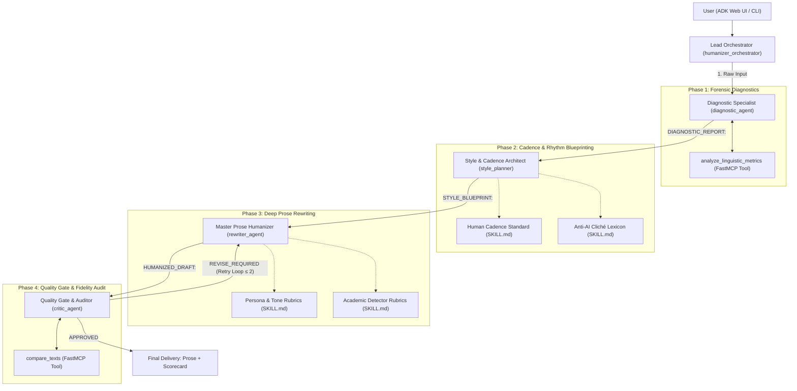

# Playbook 00: Architecture & Mental Model for Agentic Text Humanization

> **Part of the ADK Multi-Agent Text Humanizer Development Playbook**  
> **Target Audience:** AI Engineers, LLM System Designers, and ADK Practitioners

---

## 1. The Core Problem: Why AI Prose is Instantly Recognizable

Large Language Models (LLMs) and Small Language Models (SLMs) generate text by predicting the next most statistically probable token. While this guarantees grammatical accuracy and fluent structure, it introduces unmistakable synthetic artifacts:

1. **Cadence Monotony (Low Burstiness):**  
   Human writers naturally vary their sentence lengths—pairing punchy three-word sentences with rhythmic, multi-clause explanations. AI models regress to the mean, generating sentences consistently clustered between 14 and 22 words (Standard Deviation $\sigma < 4.5$).
2. **Formulaic Connective Tissue:**  
   AI prose relies heavily on mechanical transition adverbs (*"Moreover,"*, *"Furthermore,"*, *"In conclusion,"*, *"It is important to remember that"*).
3. **Cliché Density & Corporate Buzzwords:**  
   Words such as *"tapestry"*, *"testament"*, *"delve"*, *"beacon"*, *"game changer"*, and *"unleash"* are heavily over-represented in LLM alignment datasets (RLHF/DPO).
4. **Predictable Sentence Openings:**  
   Nearly every sentence opens with a subject-noun or prepositional phrase (*"By leveraging X, companies can Y"*).
5. **Academic Detector Traps:**  
   Detectors such as Turnitin and GPTZero flag stub paragraphs (isolated 1-2 sentence paragraphs), unintegrated citations (*"(Smith, 2020)"* appended without signal phrases), and clusters of generic intensifiers (*"crucial"*, *"vital"*, *"paramount"*).

---

## 2. Why Single-Prompt Humanizers Fail

Attempting to solve this in a single prompt (*"Rewrite this text to sound human and bypass AI detectors"*) fails consistently:
- **Attention Dilution:** The model cannot simultaneously juggle burstiness modulation, cliché elimination, factual preservation, tone adherence, and detector heuristics.
- **Parametric Drift:** Prompting for "casual" or "creative" rewriting often leads the model to hallucinate facts, alter statistics, or strip away key academic nuances.
- **The "Fluency is Not Evidence" Fallacy:** Without external deterministic tooling to measure sentence length standard deviation and scan for banned words, the LLM produces confident, robotic text while believing it wrote naturally.

---

## 3. The Solution: Hierarchical Orchestrator-Specialist Pipeline

We decompose the humanization task into four specialized engineering phases, coordinated by a lead orchestrator with deterministic quality gating:

---

## 4. Decoupled Execution for SLMs and Free Models

In traditional multi-agent systems, subagents pass JSON baton calls to each other. When utilizing Small Language Models (e.g. 8B–30B models on NVIDIA NIM or free tier models on OpenRouter), models often fail to emit valid JSON after generating multi-paragraph prose.

**The Architectural Solution:**
- Specialists emit structured text blocks with explicit prefixes (`DIAGNOSTIC_REPORT:`, `STYLE_BLUEPRINT:`, `HUMANIZED_DRAFT:`, `CRITIC_VERDICT:`).
- The Python Lead Orchestrator (`HumanizerOrchestrator`) deterministically parses the contracts, sequences subagents, and evaluates the Critic's quality score gate.
- This decoupling guarantees **100% execution reliability** across Gemma 31B, Llama 3.3 70B, Nemotron 30B, and lightweight local models.
