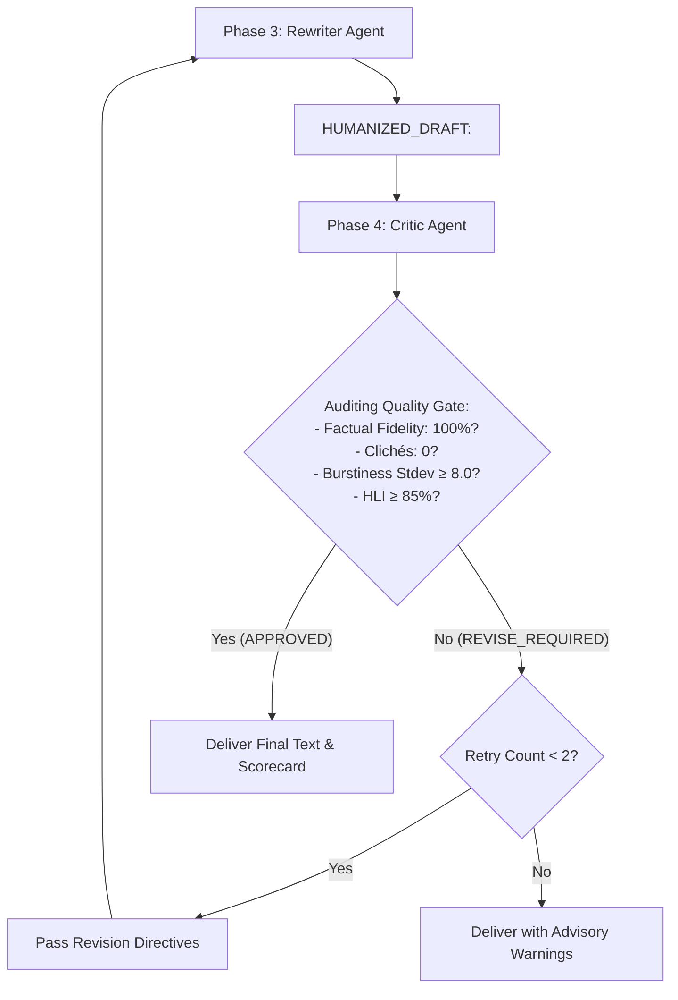

# Playbook 04: Orchestrator Architecture & Quality Score Gates

> **Part of the ADK Multi-Agent Text Humanizer Development Playbook**  
> **Target:** `agents/humanizer_orchestrator/agent.py`

---

## 1. The Lead Orchestrator Pattern

In Google ADK, complex workflows are coordinated by a custom orchestrator subclassing `google.adk.agents.BaseAgent`:

```python
from google.adk.agents import BaseAgent
from google.adk.agents.invocation_context import InvocationContext
from google.adk.events import Event

class HumanizerOrchestrator(BaseAgent):
    """Lead Workflow & Intent-Aware Orchestrator."""
    max_retries: int = 2
    sub_agents: list[BaseAgent] = [
        diagnostic_agent,
        style_planner_agent,
        rewriter_agent,
        critic_agent,
    ]
```

---

## 2. Intent Routing & Operating Modes

The orchestrator inspects user input to support three operational modes:

### Mode 1: Full Pipeline (Default)
When a user provides raw text or asks *"humanize this"*, the orchestrator executes the entire 4-phase transformation:
1. `diagnostic_agent` generates `DIAGNOSTIC_REPORT:`
2. `style_planner` translates diagnostics into `STYLE_BLUEPRINT:`
3. `rewriter_agent` drafts the humanized prose `HUMANIZED_DRAFT:`
4. `critic_agent` evaluates quality and emits `CRITIC_VERDICT:`

### Mode 1b: Fast-Track Execution (`--fast`)
When turnaround latency is critical, the orchestrator skips Phase 1 and 2, executing a high-speed 2-phase pipeline directly (`rewriter_agent` $\rightarrow$ `critic_agent`) with embedded rubrics, cutting latency by 50%+.

### Mode 2: Targeted Specialist Routing
Users can invoke specialists directly without triggering downstream tasks:
- *"just diagnose this text"* $\rightarrow$ Routes directly to `diagnostic_agent`
- *"blueprint only"* $\rightarrow$ Routes directly to `style_planner`
- *"rewrite only"* $\rightarrow$ Routes directly to `rewriter_agent`
- *"audit this rewrite"* $\rightarrow$ Routes directly to `critic_agent`

---

## 3. The Inter-Agent Prefix Protocol

To avoid brittle inter-agent dependencies, subagents communicate using explicit text blocks:

```text
DIAGNOSTIC_REPORT:
- Burstiness Stdev: 3.4 (Formulaic / Monotonous)
- Banned Clichés Found: "delve into", "testament to", "crucial"
- Baseline HLI: 44.5%

STYLE_BLUEPRINT:
- Modulation Plan: Start with 4-word punchy sentence. Merge sentences 2 & 3.
- Replacement Map: "delve into" -> "examine"; "testament to" -> "proves"

HUMANIZED_DRAFT:
<Humanized prose with dynamic cadence and zero clichés>

CRITIC_VERDICT:
- Status: APPROVED (or REVISE_REQUIRED)
- Factual Fidelity: 100%
- Burstiness Stdev: 9.8 (+6.4 improvement)
- Human-Likeness Index: 91.2% (+46.7%)
```

---

## 4. The Adaptive Quality Score Gate Loop

If `critic_agent` identifies remaining clichés or insufficient burstiness ($\sigma < 8.0$), it issues `REVISE_REQUIRED` with targeted revision directives:



This automated feedback loop ensures that no unrefined prose ever reaches the user.
