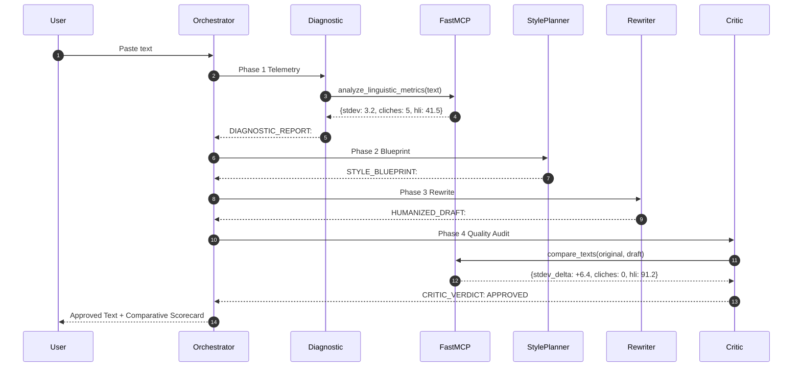

# Playbook 05: Running, Tracing & Reproducing the Agent

> **Part of the ADK Multi-Agent Text Humanizer Development Playbook**  
> **Tooling:** ADK Web UI, ADK CLI, Pytest

---

## 1. Running via the ADK Interactive Web UI

The Google ADK Web UI provides an interactive chat interface, live subagent event logs, and inspection of execution traces:

```bash
# Launch the ADK Web Server
adk web --port 8000 .
```

On Windows, helper scripts are provided:
```powershell
# PowerShell
./run_web.ps1

# Windows Command Prompt
run_web.bat
```

Open **`http://127.0.0.1:8000`** in your browser:
1. Select **`humanizer_orchestrator`** from the agent dropdown.
2. Enter your robotic text or specify a persona (*"Humanize this for an executive briefing"*).
3. Switch to the **Events** or **Traces** tab to observe the subagents collaborating in real time:
   - `diagnostic_agent` running forensic metrics.
   - `style_planner` formulating the cadence blueprint.
   - `rewriter_agent` drafting the revised prose.
   - `critic_agent` executing the quality gate audit.

---

## 2. Running via Headless ADK CLI

For automated pipelines, scripts, or terminal users, Google ADK can run agents directly from the command line:

```bash
# Single-turn CLI execution:
adk run agents/humanizer_orchestrator "Humanize: By leveraging artificial intelligence, organizations can unlock unprecedented efficiencies."

# Interactive terminal session:
adk run agents/humanizer_orchestrator
```

### Passing Fast-Track Flag via CLI:
```bash
adk run agents/humanizer_orchestrator "--fast Humanize this text: ..."
```

---

## 3. Auditing Execution Traces & Debugging

One of the key lessons from Google ADK development is **trace auditing**:



In the ADK Web UI, inspect the **Traces** tab to verify that:
1. Tools ran and returned valid numeric metrics.
2. No banned clichés escaped the rewriter.
3. Burstiness standard deviation improved significantly over the baseline.

---

## 4. Running the Automated Test Suite

Verify all deterministic algorithms, procedural skills, and agent routing logic before deploying:

```bash
# Run the full test suite
pytest tests -v
```

Expected output:
```text
tests/test_agents.py::test_skills_exist_and_populated PASSED
tests/test_agents.py::test_subagents_loaded PASSED
tests/test_agents.py::test_orchestrator_subagents_registered PASSED
tests/test_agents.py::test_orchestrator_intent_routing PASSED
tests/test_agents.py::test_model_config_resolution PASSED
tests/test_agents.py::test_mcp_server_registered PASSED
tests/test_agents.py::test_orchestrator_fast_track_detection PASSED
tests/test_agents.py::test_critic_agent_tools_streamlined PASSED
tests/test_agents.py::test_rewriter_revision_instructions PASSED
tests/test_metrics.py::test_split_sentences PASSED
tests/test_metrics.py::test_ai_cliche_detection PASSED
tests/test_metrics.py::test_burstiness_variance PASSED
tests/test_metrics.py::test_detector_heuristics PASSED
tests/test_metrics.py::test_signal_phrase_citation_integration PASSED
tests/test_metrics.py::test_compare_texts_with_detector_deltas PASSED
tests/test_metrics.py::test_edge_cases PASSED

======================== 16 passed in 2.75s ========================
```
